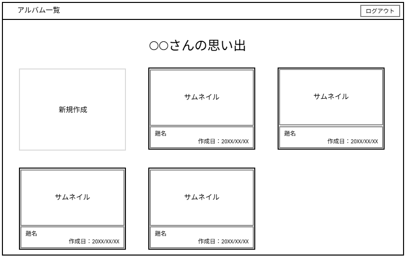

# 画面設計

## 画面遷移


<details>
<summary>mermaid記法</summary>

```
flowchart LR
    %% 開始ノード
    Start(( )) --> Login[ログイン画面]

    %% ログイン画面の分岐
    Login -- "ログイン[失敗]" --> Login
    Login -- "ログイン[成功]" --> AlbumList[アルバム一覧画面]
    Login -- "未登録" --> Register[ユーザ登録画面]

    %% ユーザ登録画面の分岐
    Register -- "登録[失敗]" --> Register
    Register -- "登録[成功]" --> AlbumList

    %% アルバム一覧画面
    AlbumList -- "ログアウト" --> Login
    AlbumList -- "編集/作成" --> AlbumEdit[アルバム編集画面]

    %% アルバム編集画面 → 保存確認ポップアップ
    AlbumEdit -- "戻る[未保存]" --> SaveConfirm[保存確認ポップアップ]
    AlbumEdit -- "戻る[保存済み]" --> AlbumList

    %% 保存確認ポップアップの選択肢
    SaveConfirm -- "キャンセル" --> AlbumEdit
    SaveConfirm -- "保存する/しない" --> AlbumList
```
</details>

## アルバム一覧


<details>
<summary>JSON</summary>

```
{
  "component": "Screen",
  "children": [
    {
      "component": "Header",
      "children": [
        {
          "component": "Text",
          "properties": {
            "contentType": "ScreenTitle", // e.g., "アルバム一覧"
            "purpose": "Displays the main title of the screen section"
          }
        },
        {
          "component": "Button",
          "properties": {
            "action": "Logout", // e.g., "ログアウト"
            "purpose": "Allows user to log out"
          }
        }
      ]
    },
    {
      "component": "Container",
      "children": [
        {
          "component": "Text",
          "properties": {
            "contentType": "ContentTitle", // e.g., "〇〇さんの思い出"
            "purpose": "Displays the title for the main content area"
          }
        },
        {
          "component": "Grid",
          "properties": {
              "purpose": "Displays items in a grid layout"
          },
          "children": [
            {
              "component": "Card",
              "properties": {
                "type": "AddNew",
                 "purpose": "Action item to create a new album"
              },
              "children": [
                {
                  "component": "Text",
                  "properties": {
                     "contentType": "Label", // e.g., "新規作成"
                     "purpose": "Label for the add new action"
                  }
                }
              ]
            },
            // This represents a repeating structure for each album
            {
              "component": "Card",
              "properties": {
                "type": "AlbumItem",
                "repeats": true,
                "purpose": "Displays a single album overview"
              },
              "children": [
                {
                  "component": "ImagePlaceholder",
                   "properties": {
                       "contentType": "ThumbnailLabel", // e.g., "サムネイル"
                       "purpose": "Area to display album thumbnail"
                    }
                },
                {
                  "component": "Container", // Details section
                   "properties": {
                       "purpose": "Container for album text details"
                    },
                  "children": [
                    {
                      "component": "Text",
                      "properties": {
                        "contentType": "AlbumTitle", // e.g., "題名"
                         "purpose": "Displays the album title"
                      }
                    },
                    {
                      "component": "Text",
                      "properties": {
                        "contentType": "CreationDate", // e.g., "作成日 : 20XX/XX/XX"
                        "purpose": "Displays the album creation date"
                      }
                    }
                  ]
                }
              ]
            }
            // ... additional AlbumItem Cards would follow the same structure
          ]
        }
      ]
    }
  ]
}
```
</details>

## アルバム編集
