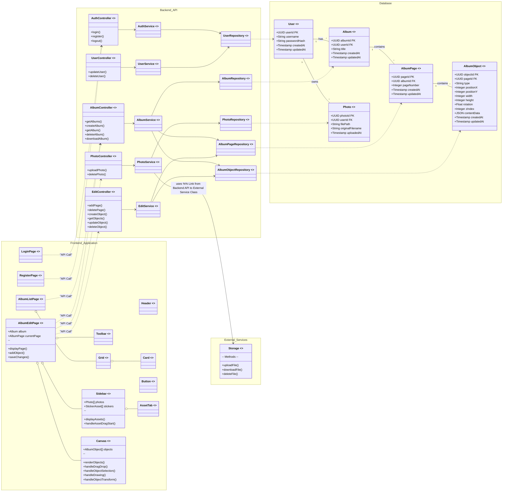

# コンポーネント設計 (クラス図)

以下のクラス図は、「アルバムメーカー」アプリケーションの主要なコンポーネントとその関係性を示します。
`definitions/requirements/system_requirements.md`、`definitions/architect/system_architecture.md`、および `definitions/architect/ui_design.md` に基づいています。

## コンポーネント概要

### バックエンド API
-   **Controllers:** フロントエンドからのリクエストを受け付け、対応するServiceを呼び出す。
-   **Services:** ビジネスロジックを担当。必要に応じて複数のRepositoryを操作する。
-   **Repositories:** データベースとのやり取り（CRUD操作）を抽象化する。

### データベース
-   **Entities:** システムで扱う主要なデータ構造（User, Album, Page, Photo, Object）。`AlbumObject` は `type` と `contentData` で写真、ステッカー、テキスト、描画などを表現する。

### フロントエンド アプリケーション (SPA)
-   **Pages:** 各画面（ログイン、一覧、編集など）に対応するコンポーネント。
-   **UI Components:** Toolbar, Canvas, Sidebar, Card など、再利用可能なUI部品。
-   **API Interaction:** バックエンドAPIを呼び出し、データの取得や更新を行う。

### 外部サービス
-   **Storage:** 写真などの静的ファイルを保存する（Azure Blob Storageを想定）。

このクラス図は、開発チームが各コンポーネントの責任範囲と相互作用を理解するための基礎となります。