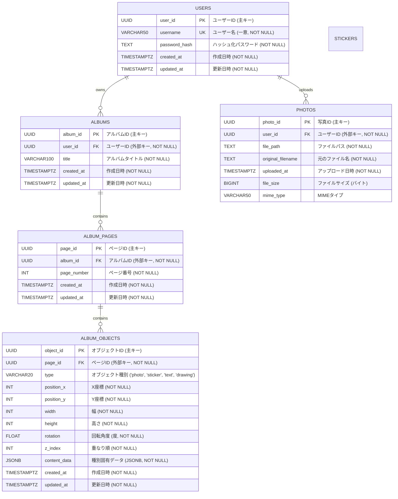

# データベーススキーマ設計

このドキュメントは、「アルバムメーカー」アプリケーションのデータベーススキーマを詳細に定義します。

## 1. ER図 (Entity Relationship Diagram)



## 2. テーブル定義詳細

### 2.1. `users` テーブル

ユーザーアカウント情報を格納します。

| カラム名        | データ型                 | 制約                                       | 説明                     |
| :-------------- | :----------------------- | :----------------------------------------- | :----------------------- |
| `user_id`       | `UUID`                   | `PRIMARY KEY`, `DEFAULT gen_random_uuid()` | ユーザーID (主キー)      |
| `username`      | `VARCHAR(50)`            | `UNIQUE`, `NOT NULL`                       | ユーザー名 (一意)        |
| `password_hash` | `TEXT`                   | `NOT NULL`                                 | ハッシュ化されたパスワード |
| `created_at`    | `TIMESTAMP WITH TIME ZONE` | `NOT NULL`, `DEFAULT CURRENT_TIMESTAMP`    | 作成日時                 |
| `updated_at`    | `TIMESTAMP WITH TIME ZONE` | `NOT NULL`, `DEFAULT CURRENT_TIMESTAMP`    | 更新日時                 |

**インデックス:**
*   `idx_users_username` (UNIQUE): `username` カラムに対する一意インデックス。

### 2.2. `albums` テーブル

ユーザーが作成したアルバムのメタ情報を格納します。

| カラム名     | データ型                 | 制約                                       | 説明                   |
| :----------- | :----------------------- | :----------------------------------------- | :--------------------- |
| `album_id`   | `UUID`                   | `PRIMARY KEY`, `DEFAULT gen_random_uuid()` | アルバムID (主キー)    |
| `user_id`    | `UUID`                   | `FOREIGN KEY (users)`, `NOT NULL`          | ユーザーID (外部キー)  |
| `title`      | `VARCHAR(100)`           | `NOT NULL`, `DEFAULT '新しいアルバム'`     | アルバムタイトル       |
| `created_at` | `TIMESTAMP WITH TIME ZONE` | `NOT NULL`, `DEFAULT CURRENT_TIMESTAMP`    | 作成日時               |
| `updated_at` | `TIMESTAMP WITH TIME ZONE` | `NOT NULL`, `DEFAULT CURRENT_TIMESTAMP`    | 更新日時               |

**外部キー制約:**
*   `user_id` は `users(user_id)` を参照 (`ON DELETE CASCADE`)

**インデックス:**
*   `idx_albums_user_id`: `user_id` カラムに対するインデックス。

### 2.3. `photos` テーブル

ユーザーがアップロードした写真の情報を格納します。

| カラム名            | データ型                 | 制約                                       | 説明                               |
| :------------------ | :----------------------- | :----------------------------------------- | :--------------------------------- |
| `photo_id`          | `UUID`                   | `PRIMARY KEY`, `DEFAULT gen_random_uuid()` | 写真ID (主キー)                    |
| `user_id`           | `UUID`                   | `FOREIGN KEY (users)`, `NOT NULL`          | ユーザーID (外部キー)              |
| `file_path`         | `TEXT`                   | `NOT NULL`                                 | ファイルパス (ストレージ上のURL/パス) |
| `original_filename` | `TEXT`                   | `NOT NULL`                                 | 元のファイル名                     |
| `uploaded_at`       | `TIMESTAMP WITH TIME ZONE` | `NOT NULL`, `DEFAULT CURRENT_TIMESTAMP`    | アップロード日時                   |
| `file_size`         | `BIGINT`                 |                                            | ファイルサイズ (バイト、任意)      |
| `mime_type`         | `VARCHAR(50)`            |                                            | MIMEタイプ (任意)                  |

**外部キー制約:**
*   `user_id` は `users(user_id)` を参照 (`ON DELETE CASCADE`)

**インデックス:**
*   `idx_photos_user_id`: `user_id` カラムに対するインデックス。

### 2.4. `album_pages` テーブル

アルバム内の各ページ情報を格納します。

| カラム名      | データ型                 | 制約                                       | 説明                   |
| :------------ | :----------------------- | :----------------------------------------- | :--------------------- |
| `page_id`     | `UUID`                   | `PRIMARY KEY`, `DEFAULT gen_random_uuid()` | ページID (主キー)      |
| `album_id`    | `UUID`                   | `FOREIGN KEY (albums)`, `NOT NULL`         | アルバムID (外部キー)  |
| `page_number` | `INTEGER`                | `NOT NULL`                                 | ページ番号             |
| `created_at`  | `TIMESTAMP WITH TIME ZONE` | `NOT NULL`, `DEFAULT CURRENT_TIMESTAMP`    | 作成日時               |
| `updated_at`  | `TIMESTAMP WITH TIME ZONE` | `NOT NULL`, `DEFAULT CURRENT_TIMESTAMP`    | 更新日時               |

**外部キー制約:**
*   `album_id` は `albums(album_id)` を参照 (`ON DELETE CASCADE`)

**制約:**
*   `uq_album_page_number`: `UNIQUE(album_id, page_number)` (アルバム内でページ番号は一意)

**インデックス:**
*   `idx_album_pages_album_id`: `album_id` カラムに対するインデックス。

### 2.5. `album_objects` テーブル

アルバムの各ページ上に配置されるオブジェクト（写真、ステッカー、テキスト、描画）の情報を格納します。

| カラム名       | データ型                 | 制約                                                                 | 説明                                                     |
| :------------- | :----------------------- | :------------------------------------------------------------------- | :------------------------------------------------------- |
| `object_id`    | `UUID`                   | `PRIMARY KEY`, `DEFAULT gen_random_uuid()`                           | オブジェクトID (主キー)                                  |
| `page_id`      | `UUID`                   | `FOREIGN KEY (album_pages)`, `NOT NULL`                              | ページID (外部キー)                                      |
| `type`         | `VARCHAR(20)`            | `NOT NULL`, `CHECK (type IN ('photo', 'sticker', 'text', 'drawing'))` | オブジェクト種別                                         |
| `position_x`   | `INTEGER`                | `NOT NULL`, `DEFAULT 0`                                              | X座標                                                    |
| `position_y`   | `INTEGER`                | `NOT NULL`, `DEFAULT 0`                                              | Y座標                                                    |
| `width`        | `INTEGER`                | `NOT NULL`                                                           | 幅                                                       |
| `height`       | `INTEGER`                | `NOT NULL`                                                           | 高さ                                                     |
| `rotation`     | `FLOAT`                  | `NOT NULL`, `DEFAULT 0.0`                                            | 回転角度 (度)                                            |
| `z_index`      | `INTEGER`                | `NOT NULL`, `DEFAULT 0`                                              | 重なり順 (大きいほど手前)                                |
| `content_data` | `JSONB`                  | `NOT NULL`                                                           | 種別固有データ (JSONB形式)                               |
| `created_at`   | `TIMESTAMP WITH TIME ZONE` | `NOT NULL`, `DEFAULT CURRENT_TIMESTAMP`                              | 作成日時                                                 |
| `updated_at`   | `TIMESTAMP WITH TIME ZONE` | `NOT NULL`, `DEFAULT CURRENT_TIMESTAMP`                              | 更新日時                                                 |

**外部キー制約:**
*   `page_id` は `album_pages(page_id)` を参照 (`ON DELETE CASCADE`)

**インデックス:**
*   `idx_album_objects_page_id`: `page_id` カラムに対するインデックス。
*   `idx_album_objects_content_data` (GIN): `content_data` カラムに対するGINインデックス (JSONB内の検索が必要な場合)。


`album_objects` テーブルの `content_data` カラムに格納されるJSONデータの構造例です。`type` カラムの値によって構造が変わります。

*   **type = 'photo'**
    ```json
    {
      "photoId": "UUID", // photosテーブルのphoto_id
      "cropInfo": { // 切り抜き情報 (任意)
        "shape": "string ('rectangle', 'circle', 'freehand')",
        "path": "string (freehandの場合のSVGパスなど)",
        "x": "integer", // 切り抜き矩形の左上X
        "y": "integer", // 切り抜き矩形の左上Y
        "width": "integer", // 切り抜き矩形の幅
        "height": "integer" // 切り抜き矩形の高さ
      }
    }
    ```
*   **type = 'sticker'**
    ```json
    {
      "stickerId": "UUID" // stickersテーブルのsticker_id (FK)
    }
    ```
*   **type = 'text'**
    ```json
    {
      "text": "string", // テキスト内容
      "font": "string", // フォント名
      "size": "integer", // フォントサイズ
      "color": "string", // 色コード (#RRGGBB)
      "bold": "boolean" // 太字かどうか
    }
    ```
*   **type = 'drawing'**
    ```json
    {
      "pathData": "string", // 描画パスデータ (例: SVG path d属性)
      "color": "string", // 色コード (#RRGGBB)
      "thickness": "integer" // 線の太さ
    }
    ```


*   **タイムスタンプ:** `TIMESTAMP WITH TIME ZONE` を使用し、タイムゾーン情報を保持します。
*   **主キー:** `UUID` を使用し、分散環境での衝突リスクを低減します。`gen_random_uuid()` 関数 (PostgreSQLなど) の利用を想定します。
*   **外部キー:** `ON DELETE CASCADE` を設定し、親レコード削除時に子レコードも自動削除されるようにします（例: ユーザー削除時にそのユーザーのアルバム、写真も削除）。
*   **インデックス:** 主要な検索キーや外部キーにはインデックスを作成し、パフォーマンスを向上させます。`content_data` の検索要件に応じてGINインデックスの追加を検討します。

### 2.6. `stickers` テーブル

システムで利用可能なステッカーのメタ情報を格納します。ステッカーの画像ファイル自体はAzure Blob Storageに保存されます。

| カラム名           | データ型                 | 制約                                       | 説明                                   |
| :----------------- | :----------------------- | :----------------------------------------- | :------------------------------------- |
| `sticker_id`       | `UUID`                   | `PRIMARY KEY`, `DEFAULT gen_random_uuid()` | ステッカーID (主キー)                  |
| `name`             | `VARCHAR(100)`           | `NOT NULL`                                 | ステッカー名                           |
| `category`         | `VARCHAR(50)`            |                                            | カテゴリ (任意)                        |
| `file_path`        | `TEXT`                   | `NOT NULL`                                 | ファイルパス (ストレージ上のURL/パス)    |
| `thumbnail_path`   | `TEXT`                   |                                            | サムネイルパス (任意)                  |
| `tags`             | `TEXT[]`                 |                                            | 検索用タグ (任意, 配列)                |
| `created_at`       | `TIMESTAMP WITH TIME ZONE` | `NOT NULL`, `DEFAULT CURRENT_TIMESTAMP`    | 作成日時                               |
| `updated_at`       | `TIMESTAMP WITH TIME ZONE` | `NOT NULL`, `DEFAULT CURRENT_TIMESTAMP`    | 更新日時                               |

**インデックス:**
*   `idx_stickers_name`: `name` カラムに対するインデックス。
*   `idx_stickers_category`: `category` カラムに対するインデックス。
*   `idx_stickers_tags` (GIN): `tags` カラムに対するGINインデックス (配列内検索が必要な場合)。

## 3. `content_data` (JSONB) の構造例

`album_objects` テーブルの `content_data` カラムに格納されるJSONデータの構造例です。`type` カラムの値によって構造が変わります。

*   **type = 'photo'**
    ```json
    {
      "photoId": "UUID", // photosテーブルのphoto_id
      "cropInfo": { // 切り抜き情報 (任意)
        "shape": "string ('rectangle', 'circle', 'freehand')",
        "path": "string (freehandの場合のSVGパスなど)",
        "x": "integer", // 切り抜き矩形の左上X
        "y": "integer", // 切り抜き矩形の左上Y
        "width": "integer", // 切り抜き矩形の幅
        "height": "integer" // 切り抜き矩形の高さ
      }
    }
    ```
*   **type = 'sticker'**
    ```json
    {
      "stickerId": "UUID" // stickersテーブルのsticker_id (FK)
    }
    ```
*   **type = 'text'**
    ```json
    {
      "text": "string", // テキスト内容
      "font": "string", // フォント名
      "size": "integer", // フォントサイズ
      "color": "string", // 色コード (#RRGGBB)
      "bold": "boolean" // 太字かどうか
    }
    ```
*   **type = 'drawing'**
    ```json
    {
      "pathData": "string", // 描画パスデータ (例: SVG path d属性)
      "color": "string", // 色コード (#RRGGBB)
      "thickness": "integer" // 線の太さ
    }
    ```

## 4. その他考慮事項

*   **タイムスタンプ:** `TIMESTAMP WITH TIME ZONE` を使用し、タイムゾーン情報を保持します。
*   **主キー:** `UUID` を使用し、分散環境での衝突リスクを低減します。`gen_random_uuid()` 関数 (PostgreSQLなど) の利用を想定します。
*   **外部キー:** `ON DELETE CASCADE` を設定し、親レコード削除時に子レコードも自動削除されるようにします（例: ユーザー削除時にそのユーザーのアルバム、写真も削除）。`album_objects` の `content_data` 内の `stickerId` は `stickers(sticker_id)` を論理的に参照しますが、JSONB内の値であるため、データベースレベルでの直接的な外部キー制約は設定が難しい場合があります。アプリケーションレベルでの整合性担保を検討します。
*   **インデックス:** 主要な検索キーや外部キーにはインデックスを作成し、パフォーマンスを向上させます。`content_data` の検索要件に応じてGINインデックスの追加を検討します。
