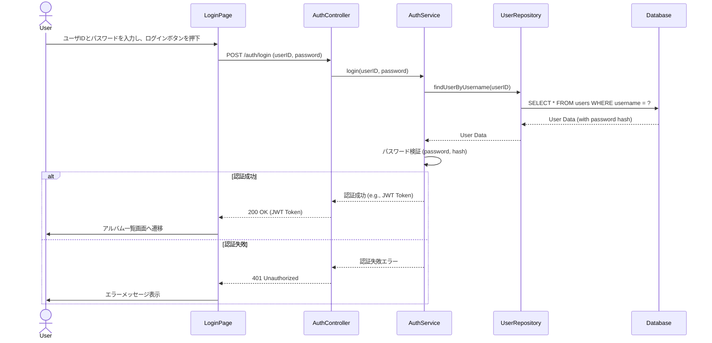
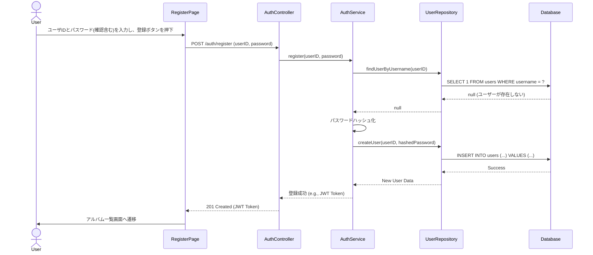
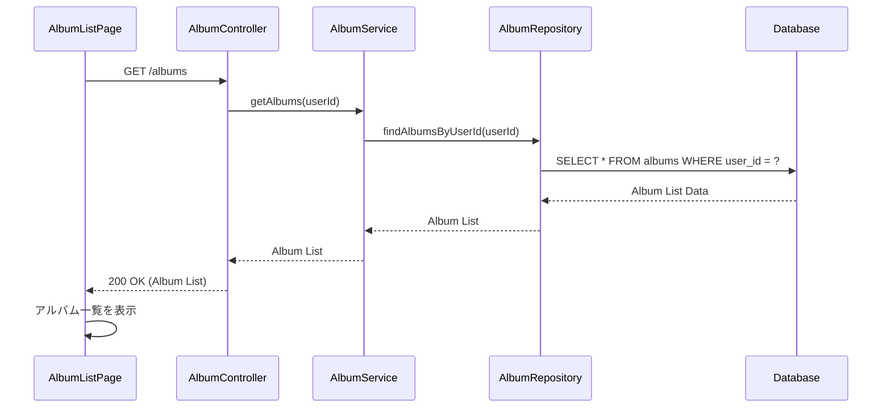
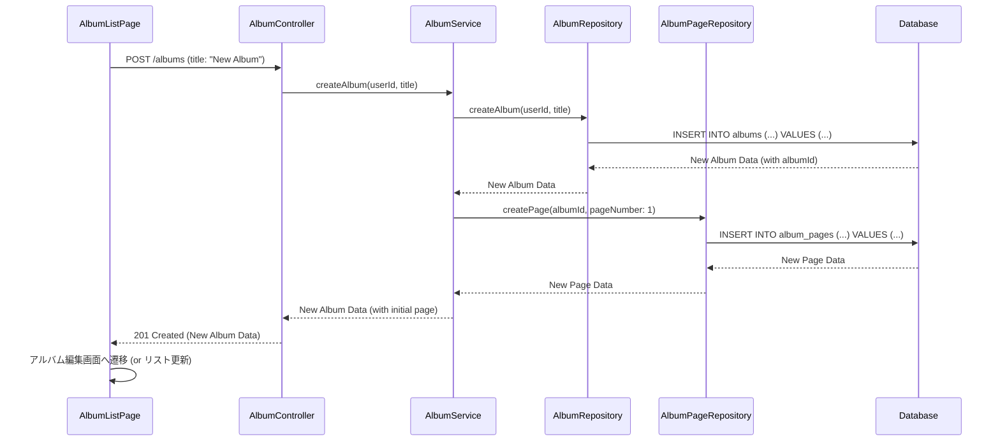
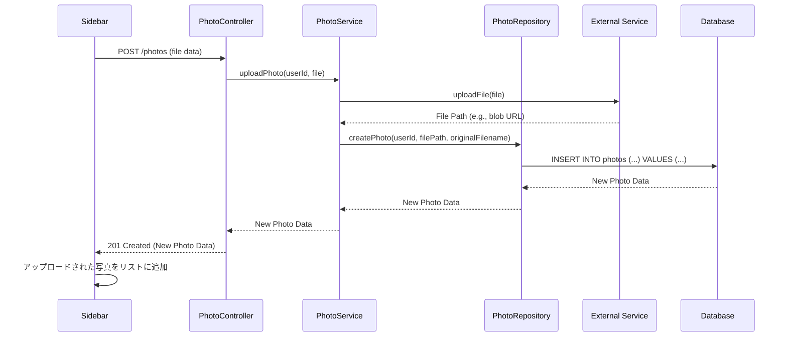
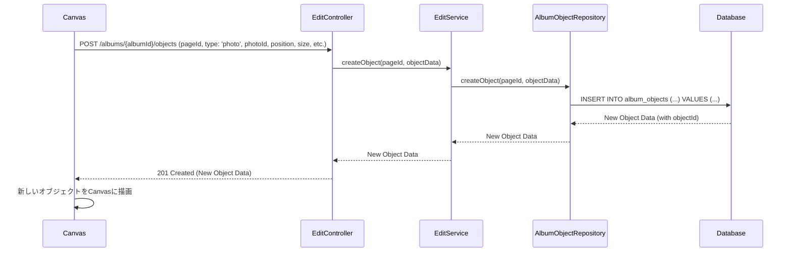
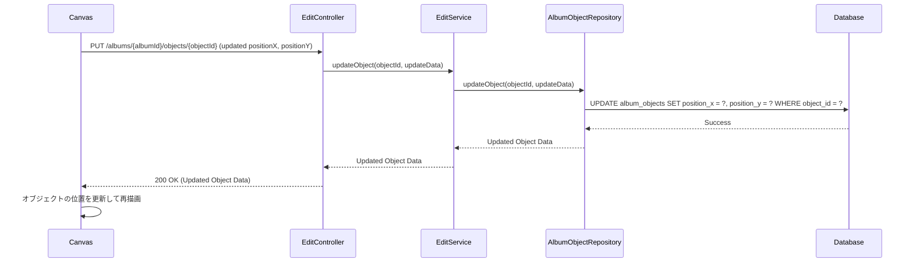
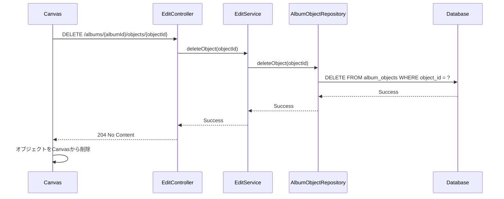

# シーケンス図

このドキュメントでは、主要なユースケースにおけるコンポーネント間のインタラクションをシーケンス図で示します。

## 1. ログイン処理



## 2. 新規ユーザー登録



## 3. アルバム一覧取得



## 4. 新規アルバム作成



## 5. 写真アップロード



## 6. アルバムページへのオブジェクト追加 (写真)



## 7. アルバムページ上のオブジェクト更新 (移動)



## 8. アルバムページからのオブジェクト削除



## 9. アルバムダウンロード

```mermaid
sequenceDiagram
    participant Toolbar
    participant AlbumController
    participant AlbumService
    participant AlbumRepository
    participant AlbumPageRepository
    participant AlbumObjectRepository
    participant Database

    Toolbar->>AlbumController: GET /albums/{albumId}/download
    AlbumController->>AlbumService: getAlbumDataForDownload(albumId)
    AlbumService->>AlbumRepository: findAlbumById(albumId)
    AlbumRepository->>Database: SELECT * FROM albums WHERE album_id = ?
    Database-->>AlbumRepository: Album Data
    AlbumRepository-->>AlbumService: Album Data
    AlbumService->>AlbumPageRepository: findPagesByAlbumId(albumId)
    AlbumPageRepository->>Database: SELECT * FROM album_pages WHERE album_id = ? ORDER BY page_number
    Database-->>AlbumPageRepository: Page List Data
    AlbumPageRepository-->>AlbumService: Page List
    loop For Each Page
        AlbumService->>AlbumObjectRepository: findObjectsByPageId(pageId)
        AlbumObjectRepository->>Database: SELECT * FROM album_objects WHERE page_id = ?
        Database-->>AlbumObjectRepository: Object List Data for Page
        AlbumObjectRepository-->>AlbumService: Object List
    end
    AlbumService->>AlbumService: アルバムデータからPDFを生成 (詳細省略)
    AlbumService-->>AlbumController: PDF Data
    AlbumController-->>Toolbar: 200 OK (PDF File Stream)
    Toolbar->>Toolbar: ファイルダウンロードを開始