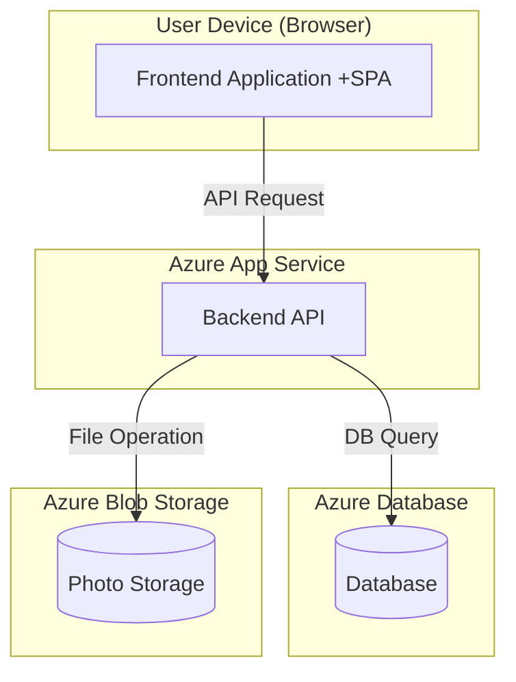

# システムアーキテクチャ設計

## 1. 概要

本ドキュメントは、「アルバムメーカー」アプリケーションのシステムアーキテクチャを定義します。
`definitions/requirements/system_requirements.md` および `definitions/architect/ui_design.md` に基づき、システムの構成要素、それらの間の連携、およびデータ構造の概要を示します。

## 2. システム構成

`system_requirements.md` に記載の通り、以下のクラウドサービスを利用します。

-   **アプリケーションサーバー:** Azure App Service
    -   フロントエンドアプリケーションとバックエンドAPIをホストします。
-   **データベースサーバー:** Azure Database (例: PostgreSQL, MySQL)
    -   アプリケーションデータを永続化します。
-   **ストレージ:** Azure Blob Storage (想定)
    -   アップロードされた写真ファイルを保存します。

## 3. アーキテクチャ概要図 (コンポーネント図)

## 4. 主要コンポーネント

### 4.1. フロントエンド (Frontend Application)

-   **役割:** ユーザーインターフェースの提供、ユーザー操作の受付、バックエンドAPIとの通信。
-   **技術スタック:** **TypeScript, React** (状態管理ライブラリ: 例 Redux, Zustand)
-   **主要機能:**
    -   画面描画 (`ui_design.md` 参照)
    -   ユーザー認証 (ログイン、新規登録)
    -   アルバム一覧表示、作成、削除
    -   アルバム編集機能 (ドラッグ＆ドロップ、オブジェクト操作、テキスト入力、描画など)
    -   写真アップロードインターフェース
    -   バックエンドAPIとのデータ送受信

### 4.2. バックエンド (Backend API)

-   **役割:** ビジネスロジックの実行、データ永続化、フロントエンドへのAPI提供。
-   **技術スタック:** **Node.js (TypeScript), NestJS**
-   **ランタイム:** **Node.js 22 LTS on Azure App Service**
-   **主要APIエンドポイント (例):**
    -   `/auth`: ユーザー認証 (ログイン、登録、ログアウト)
    -   `/users`: ユーザー情報管理 (更新、削除)
    -   `/albums`: アルバム管理 (一覧取得、作成、取得、削除、ダウンロード)
    -   `/albums/{albumId}/photos`: 写真管理 (アップロード、削除)
    -   `/albums/{albumId}/pages`: ページ管理 (追加、削除)
    -   `/albums/{albumId}/objects`: アルバム編集オブジェクト管理 (作成、取得、更新、削除)
-   **主要コントローラー (例):**
    -   `AuthController`: 認証ロジック
    -   `UserController`: ユーザー関連ロジック
    -   `AlbumController`: アルバム関連ロジック
    -   `PhotoController`: 写真関連ロジック
    -   `EditController`: アルバム編集関連ロジック

### 4.3. データベース (Database)

-   **役割:** アプリケーションデータの永続化。
-   **主要テーブル (例):**
    -   `users`: ユーザー情報 (user_id, username, password_hash, created_at, updated_at)
    -   `albums`: アルバム情報 (album_id, user_id, title, created_at, updated_at)
    -   `album_pages`: アルバムページ情報 (page_id, album_id, page_number, created_at, updated_at)
    -   `photos`: アップロードされた写真情報 (photo_id, user_id, file_path, original_filename, uploaded_at)
    -   `album_objects`: アルバム上のオブジェクト情報 (object_id, page_id, type, position_x, position_y, width, height, rotation, z_index, content_data, created_at, updated_at)
        -   `type`: 'photo', 'sticker', 'text', 'drawing'
        -   `content_data`:
            -   photo: `photo_id`, crop_info
            -   sticker: `sticker_id`
            -   text: text_content, font, size, color, bold
            -   drawing: drawing_data (path, color, thickness)

### 4.4. ストレージ (Photo Storage)

-   **役割:** アップロードされた写真ファイルの保存と提供。
-   **技術:** Azure Blob Storage など。
-   **連携:** バックエンドAPIがファイルのアップロード、ダウンロード、削除を処理。

## 5. データフロー (例: アルバム編集内容の保存)

1.  **Frontend:** ユーザーがアルバム上のオブジェクトを編集 (移動、サイズ変更など)。
2.  **Frontend:** 変更内容を検知し、バックエンドAPI (`/albums/{albumId}/objects/{objectId}`) に PUT リクエストを送信。リクエストボディには更新されたオブジェクト情報 (位置、サイズなど) を含める。
3.  **Backend (EditController):** リクエストを受け取り、認証・認可を確認。
4.  **Backend:** リクエストボディのデータに基づき、データベースの `album_objects` テーブルの該当レコードを更新。
5.  **Backend:** 更新結果 (成功/失敗) をフロントエンドにレスポンスとして返す。
6.  **Frontend:** レスポンスを受け取り、UIに反映 (またはエラー表示)。

## 6. 今後の検討事項

-   各コンポーネントの詳細設計 (クラス図、シーケンス図など) - **完了**
-   API仕様の詳細化 (リクエスト/レスポンス形式、エラーハンドリング) - **完了**
-   データベーススキーマの詳細設計 (型、制約、インデックス) - **完了**
-   非機能要件 (パフォーマンス、セキュリティ、スケーラビリティ) の考慮
-   認証・認可方式の詳細 (例: JWT)
-   リアルタイム共同編集の要否と実現方式 (必要であれば)