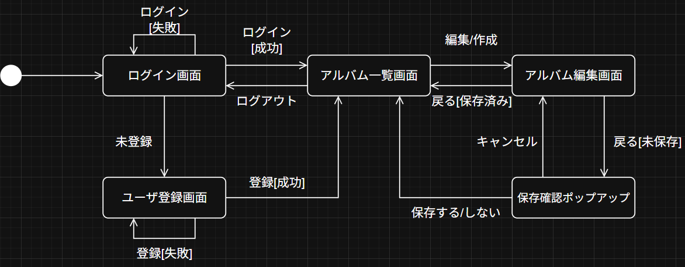
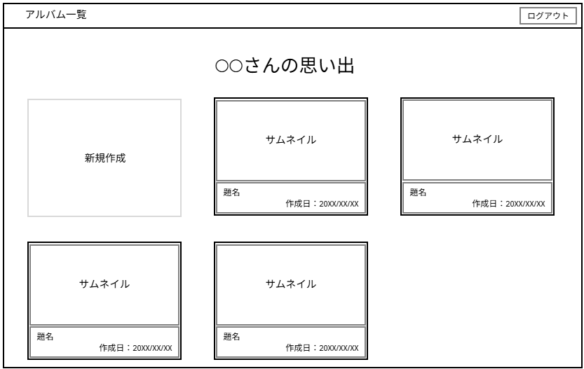
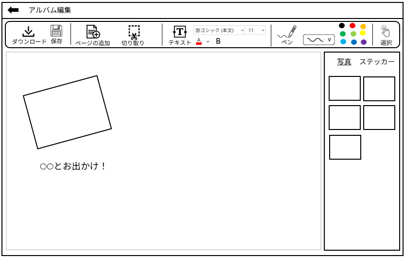

# 画面設計

## 画面遷移


<details>
<summary>mermaid記法</summary>

```
flowchart LR
    %% 開始ノード
    Start(( )) --> Login[ログイン画面]

    %% ログイン画面の分岐
    Login -- "ログイン[失敗]" --> Login
    Login -- "ログイン[成功]" --> AlbumList[アルバム一覧画面]
    Login -- "未登録" --> Register[ユーザ登録画面]

    %% ユーザ登録画面の分岐
    Register -- "登録[失敗]" --> Register
    Register -- "登録[成功]" --> AlbumList

    %% アルバム一覧画面
    AlbumList -- "ログアウト" --> Login
    AlbumList -- "編集/作成" --> AlbumEdit[アルバム編集画面]

    %% アルバム編集画面 → 保存確認ポップアップ
    AlbumEdit -- "戻る[未保存]" --> SaveConfirm[保存確認ポップアップ]
    AlbumEdit -- "戻る[保存済み]" --> AlbumList

    %% 保存確認ポップアップの選択肢
    SaveConfirm -- "キャンセル" --> AlbumEdit
    SaveConfirm -- "保存する/しない" --> AlbumList
```
</details>

## アルバム一覧


<details>
<summary>JSON</summary>

```
{
  "component": "Screen",
  "children": [
    {
      "component": "Header",
      "children": [
        {
          "component": "Text",
          "properties": {
            "contentType": "ScreenTitle", // e.g., "アルバム一覧"
            "purpose": "Displays the main title of the screen section"
          }
        },
        {
          "component": "Button",
          "properties": {
            "action": "Logout", // e.g., "ログアウト"
            "purpose": "Allows user to log out"
          }
        }
      ]
    },
    {
      "component": "Container",
      "children": [
        {
          "component": "Text",
          "properties": {
            "contentType": "ContentTitle", // e.g., "〇〇さんの思い出"
            "purpose": "Displays the title for the main content area"
          }
        },
        {
          "component": "Grid",
          "properties": {
              "purpose": "Displays items in a grid layout"
          },
          "children": [
            {
              "component": "Card",
              "properties": {
                "type": "AddNew",
                 "purpose": "Action item to create a new album"
              },
              "children": [
                {
                  "component": "Text",
                  "properties": {
                     "contentType": "Label", // e.g., "新規作成"
                     "purpose": "Label for the add new action"
                  }
                }
              ]
            },
            // This represents a repeating structure for each album
            {
              "component": "Card",
              "properties": {
                "type": "AlbumItem",
                "repeats": true,
                "purpose": "Displays a single album overview"
              },
              "children": [
                {
                  "component": "ImagePlaceholder",
                   "properties": {
                       "contentType": "ThumbnailLabel", // e.g., "サムネイル"
                       "purpose": "Area to display album thumbnail"
                    }
                },
                {
                  "component": "Container", // Details section
                   "properties": {
                       "purpose": "Container for album text details"
                    },
                  "children": [
                    {
                      "component": "Text",
                      "properties": {
                        "contentType": "AlbumTitle", // e.g., "題名"
                         "purpose": "Displays the album title"
                      }
                    },
                    {
                      "component": "Text",
                      "properties": {
                        "contentType": "CreationDate", // e.g., "作成日 : 20XX/XX/XX"
                        "purpose": "Displays the album creation date"
                      }
                    }
                  ]
                }
              ]
            }
            // ... additional AlbumItem Cards would follow the same structure
          ]
        }
      ]
    }
  ]
}
```
</details>

## アルバム編集


<details>
<summary> JSON </summary>

{
  "ui_structure": {
    "layout": {
      "type": "main_window",
      "orientation": "vertical",
      "children": [
        {
          "id": "header_bar",
          "type": "navigation_bar",
          "orientation": "horizontal",
          "items": [
            {"id": "back_button", "label": "Back", "type": "button", "icon": "arrow_back"},
            {"id": "page_title", "label": "アルバム編集", "type": "title"}
          ]
        },
        {
          "id": "top_bar",
          "type": "toolbar",
          "orientation": "horizontal",
          "items": [
            {
              "id": "file_operations",
              "type": "button_group",
              "buttons": [
                {"id": "download", "label": "Download"},
                {"id": "save", "label": "Save"},
                {"id": "add_page", "label": "Add Page"}
              ]
            },
            {
              "id": "image_operations",
              "type": "button_group",
              "buttons": [
                {"id": "cut_images", "label": "Cut Images"}
              ]
            },
            {
              "id": "text_tools",
              "type": "tool_group",
              "items": [
                {"id": "add_text_box", "label": "Add Text Box", "type": "button"},
                {"id": "font_selector", "label": "Font", "type": "dropdown"},
                {"id": "font_size_selector", "label": "Size", "type": "dropdown"},
                {"id": "text_color_selector", "label": "Color", "type": "color_palette", "colors_ref": "color_palette"},
                {"id": "bold_toggle", "label": "Bold", "type": "toggle_button"}
              ]
            },
            {
              "id": "drawing_tools",
              "type": "tool_group",
              "items": [
                {"id": "pen_tool", "label": "Pen", "type": "button"},
                {"id": "pen_thickness_selector", "label": "Thickness", "type": "selector"},
                {"id": "pen_color_selector", "label": "Color", "type": "color_palette", "colors_ref": "color_palette"}
              ]
            },
            {
              "id": "selection_tool",
              "type": "button_group",
              "buttons": [
                {"id": "select_object", "label": "Select Object"}
              ]
            }
          ]
        },
        {
          "id": "main_area",
          "type": "container",
          "orientation": "horizontal",
          "children": [
            {
              "id": "editing_canvas",
              "type": "canvas",
              "description": "Main area for content editing"
            },
            {
              "id": "right_sidebar",
              "type": "sidebar",
              "children": [
                {
                  "id": "asset_tabs",
                  "type": "tab_container",
                  "tabs": [
                    {"id": "pictures_tab", "label": "Pictures"},
                    {"id": "stickers_tab", "label": "Stickers"}
                  ]
                },
                {
                  "id": "asset_content",
                  "type": "content_area",
                  "description": "Displays content based on selected tab (Pictures/Stickers)"
                }
              ]
            }
          ]
        }
      ]
    },
    "definitions": {
      "color_palette": [
        {"name": "Black", "hex": "#000000"},
        {"name": "Red", "hex": "#FF0000"},
        {"name": "Orange", "hex": "#FFA500"},
        {"name": "Green", "hex": "#008000"},
        {"name": "Lime Green", "hex": "#32CD32"},
        {"name": "Yellow", "hex": "#FFFF00"},
        {"name": "Cyan/Sky Blue", "hex": "#00BFFF"},
        {"name": "Blue", "hex": "#0000FF"},
        {"name": "Purple", "hex": "#800080"}
      ]
    }
  }
}
</details>