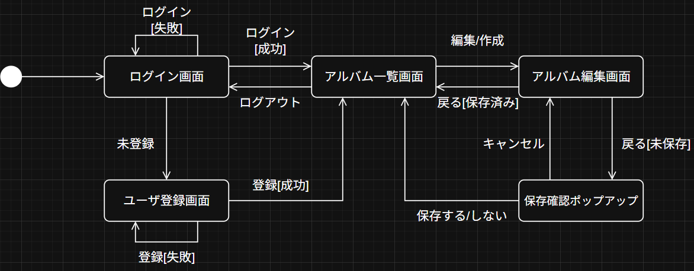
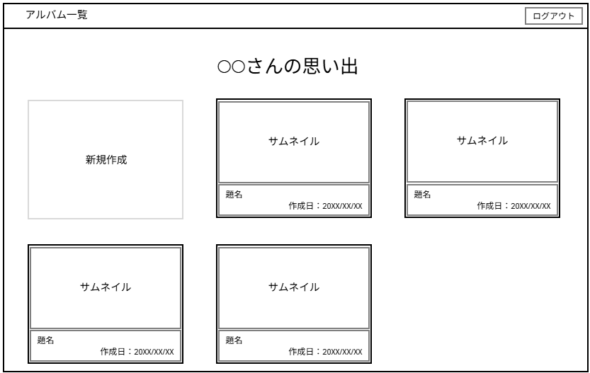
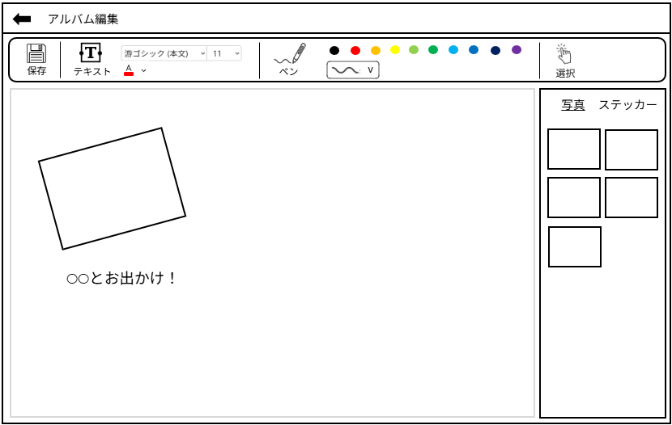

# 要件定義書

## 製品名
アルバムメーカー

## 製品概要
- オンライン上に写真をアップロードし，アルバムを作れるアプリ
- 現実でアルバムを作るような操作感
- テキストやスタンプなどでデコレーション

## 目的
写真をデジタルで保存することが多くなった現在において，昔のアルバムのように思い出を保存できるサービスを提供する
- 写真の切り貼り
- デコレーション
- 思い出を書き込む

## システム構成
- アプリサーバー：Azure app service
    - フロントエンド
    - バックエンド
- データベースサーバー：Azure database

## 機能要件

### 画面一覧
|画面名|説明|
|-----|----|
|ユーザ登録画面|ユーザIDとパスワードの入力を行う． パスワードは再入力によって確認する．|
|ログイン画面|ユーザIDとパスワードによる認証を行う．|
|アルバム一覧画面|作成済みのアルバムを一覧表示する．|
|アルバム編集画面|wordのような画面を想定． 写真の切り貼り・アップロードやステッカー，書き込みなどすべてを行う．|

### 機能一覧
|分類|機能名|説明|
|----|-----|----|
|ユーザ管理|新規ユーザ登録|ユーザIDとパスワードを登録する．|
|ユーザ管理|ユーザ情報更新|パスワードを変更する．|
|ユーザ管理|ユーザ削除|ユーザ情報およびユーザ情報に結び付くデータを削除する．|
|ユーザ管理|ログイン|入力されたユーザIDとパスワードを用いて認証を行う．|
|アルバム管理|アルバム取得|ユーザが作成したアルバムを取得する．|
|アルバム管理|アルバム表示|ユーザが作成したアルバムを表示する．|
|アルバム管理|新規アルバム作成|新規のアルバムを作成する．|
|アルバム管理|アルバム削除|選択したアルバムを削除する．|
|アルバム管理|アルバムのダウンロード|アルバムをpdf形式でダウンロードする．|
|写真管理|写真のアップロード|アルバムに写真をアップロードする．|
|写真管理|写真の削除|アルバムの写真を削除する．|
|アルバム編集|ページを追加する|アルバムに新たなページを追加する．|
|アルバム編集|写真を貼る|アップロード済み写真をドラッグ＆ドロップしてアルバムに貼る．|
|アルバム編集|写真を切り取る|アルバムに貼った写真を切り取る． 1. 図形の型 2. フリーハンド|
|アルバム編集|ステッカーを貼る|用意されたステッカーをドラッグ＆ドロップしてアルバムに貼る． 1. マスキングテープ 2. 吹き出し 3. 付箋 4. ハートなどの図形|
|アルバム編集|テキストを追加する|テキストボックスを貼る．|
|アルバム編集|テキストの色を変更する|テキストの色を変更する．|
|アルバム編集|テキストのサイズを変更する|テキストのサイズを変更する．|
|アルバム編集|書き込む|ペンでアルバムに書き込む．|
|アルバム編集|ペンの色を変更する|ペンの色を変更する．|
|アルバム編集|ペンの太さを変更する|ペンの太さを変更する．|
|アルバム編集|オブジェクトを傾ける|アルバムに貼ったオブジェクトの角度を変更する．|
|アルバム編集|オブジェクトを移動する|アルバムに貼ったオブジェクトをドラッグ＆ドロップして好きな位置へ移動する．|
|アルバム編集|オブジェクトのサイズを変更する|アルバムに貼ったオブジェクトのサイズを変更する．|
|アルバム編集|オブジェクトを削除する|アルバムに貼ったオブジェクトを削除する．|

### データベース
- ユーザID・パスワード
- アルバム
- 写真

### 将来的な機能拡張
|分類|機能名|説明|
|----|-----|----|
|アルバム編集|テンプレートを選択する|アルバムのテンプレートを選択して適用する．|
|アルバム編集|写真に効果をつける|アルバムに貼った写真の縁にエフェクトを付ける．|
|アルバム編集|台紙の色を変更する|アルバムの台紙の色を変更する．|
|アルバム編集|テキストのフォントを変更する|テキストのフォントを変更する．|

## 非機能要件
わからないためスキップ

## 画面

### 画面遷移

### アルバム一覧

### アルバム編集

## ユースケース

### ログインする

### アルバムを作成する

### アルバムを削除する

### アルバムをダウンロードする

### アルバムを編集する

#### アルバムにページを追加する

#### アルバムに写真をアップロードする

#### アルバムに写真を貼る

#### 写真を切り取る

#### ステッカーを貼る

#### テキストを追加する

#### テキストの色を変える

#### テキストの太さを変える

#### ペンで書き込む

#### ペンの色を変更する

#### ペンの太さを変更する

#### オブジェクトを傾ける

#### オブジェクトを移動する

#### オブジェクトのサイズを変更する

#### オブジェクトを削除する